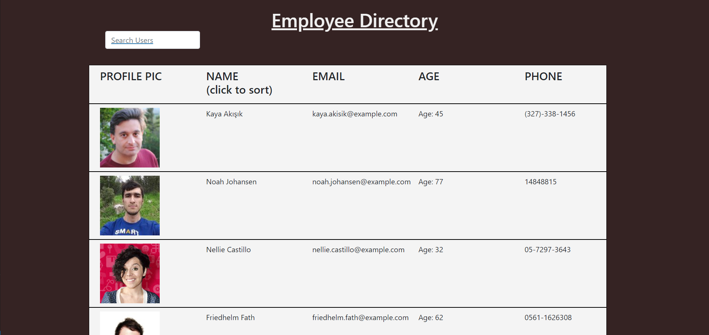

# employee-tracker

## Description 

This application will keep track of an employee directory made with React. The user is able to sort their list of randomly generated employees by ascending and descending order of the names. The user can also search for a specific user.

## Table of Contents 

* [Installation](#installation)
* [Usage](#usage)
* [Credits](#credits)
* [License](#license)

## Installation

To install the project files, you can clone the "employee-directory" repository which contains the necessary files at https://github.com/jgarcia60/employee-directory by clicking the green drop down "Code" and cloning the repo with an SSH key.

## Usage 

You may use this code to learn about using React, making API calls in React, or using sorting or onChange functions. Here is the deployed site:

https://jgarcia60.github.io/employee-directory/

This is what it looks like:

## Credits

All code for this project was developed by Jonathan Garcia (https://github.com/jgarcia60/). 

## License

MIT License

Copyright (c) [2020] [Jonathan Garcia]

Permission is hereby granted, free of charge, to any person obtaining a copy
of this software and associated documentation files (the "Software"), to deal
in the Software without restriction, including without limitation the rights
to use, copy, modify, merge, publish, distribute, sublicense, and/or sell
copies of the Software, and to permit persons to whom the Software is
furnished to do so, subject to the following conditions:
The above copyright notice and this permission notice shall be included in all
copies or substantial portions of the Software.

THE SOFTWARE IS PROVIDED "AS IS", WITHOUT WARRANTY OF ANY KIND, EXPRESS OR
IMPLIED, INCLUDING BUT NOT LIMITED TO THE WARRANTIES OF MERCHANTABILITY,
FITNESS FOR A PARTICULAR PURPOSE AND NONINFRINGEMENT. IN NO EVENT SHALL THE
AUTHORS OR COPYRIGHT HOLDERS BE LIABLE FOR ANY CLAIM, DAMAGES OR OTHER
LIABILITY, WHETHER IN AN ACTION OF CONTRACT, TORT OR OTHERWISE, ARISING FROM,
OUT OF OR IN CONNECTION WITH THE SOFTWARE OR THE USE OR OTHER DEALINGS IN THE
SOFTWARE.

---